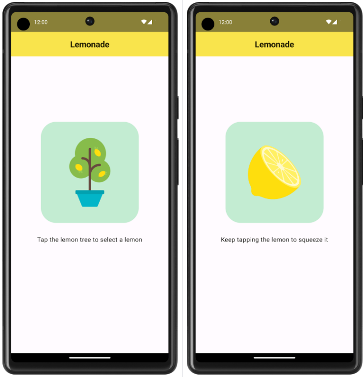
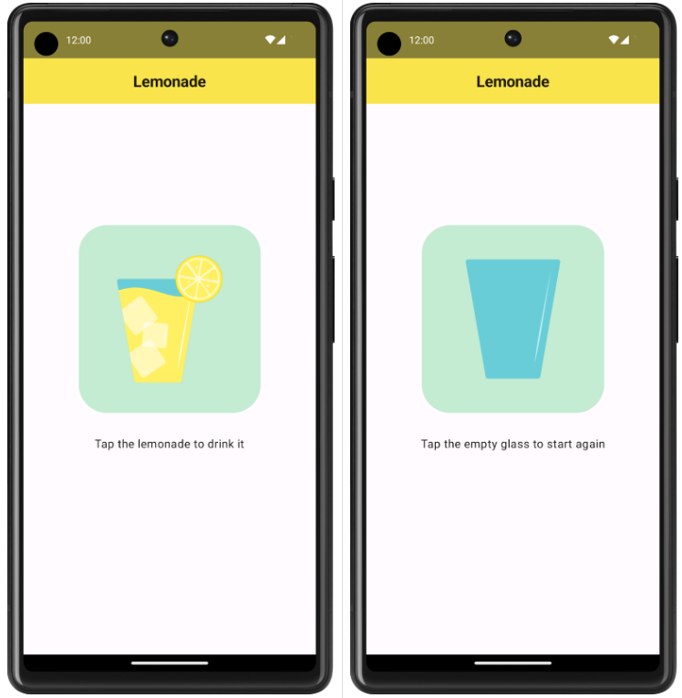

# appLemonade_Compose
Confira como o app funciona:

1. Quando o usuário abrir o app pela primeira vez, ele verá um limoeiro. Será mostrado um texto pedindo para o usuário tocar na imagem do limoeiro para "pegar" um limão.
2. Depois de tocar no limoeiro, um limão será mostrado. O usuário vai receber uma solicitação para tocar no limão e "espremer" a fruta para fazer a limonada. É necessário tocar no limão várias vezes. O número de toques necessários para espremer o limão varia e é gerado aleatoriamente (entre 2 e 4).
3. Depois de tocar no limão quantas vezes forem necessárias, um copo refrescante de limonada será mostrado. O usuário precisa tocar no copo para "tomar" a limonada.
4. Após tocar no copo de limonada, o usuário verá um copo vazio. É necessário tocar no copo vazio para começar de novo.
5. Depois de tocar no copo vazio, o limoeiro será mostrado e o usuário vai poder começar o processo novamente. Mais limonada!

Confira a aparência do app nestas capturas de tela maiores:

